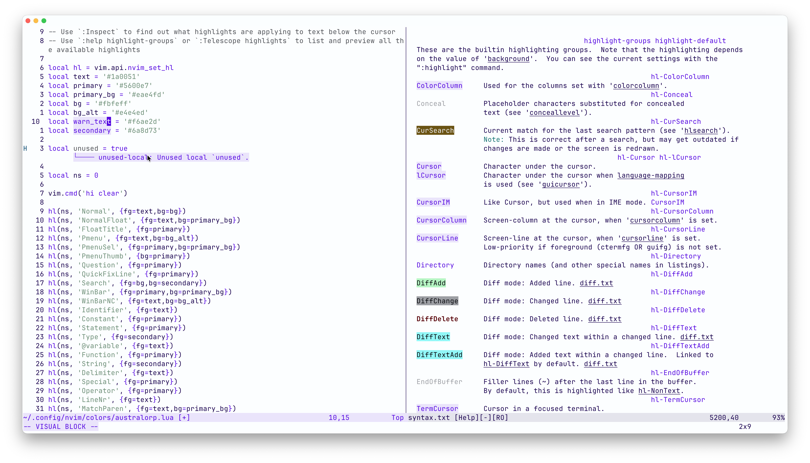

I have wanted to make my own NeoVim theme for a while, but I never knew what would be a good color palette for it.
That is, until I made this site and realized I enjoy the slightly off-white background with purple-ish text.
So, I decided to make a NeoVim theme based on this website's colors, and it was easier than I thought.

<figure>

To use this, put it in `~/.config/nvim/colors/australorp.lua` and add `vim.cmd('colorscheme australorp')` to your `~/.config/nvim/init.lua`.
I also had to add `vim.o.background = 'light'`, so try adding that if you have any issues.

```lua
-- Use `:Inspect` to find out what highlights are applying to text below the cursor
-- Use `:help highlight-groups` or `:Telescope highlights` to list and preview all the available highlights

local hl = vim.api.nvim_set_hl
local text = '#1a0051'
local primary = '#5600e7'
local primary_bg = '#eae4fd'
local bg = '#fbfeff'
local bg_alt = '#e4e4ed'
local warn_text = '#f6ae2d'
local secondary = '#6a8d73'

local ns = 0

vim.cmd('hi clear')

hl(ns, 'Normal', {fg=text,bg=bg})
hl(ns, 'NormalFloat', {fg=text,bg=primary_bg})
hl(ns, 'FloatTitle', {fg=primary})
hl(ns, 'Pmenu', {fg=text,bg=bg_alt})
hl(ns, 'PmenuSel', {fg=primary,bg=primary_bg})
hl(ns, 'PmenuThumb', {bg=primary})
hl(ns, 'Question', {fg=primary})
hl(ns, 'QuickFixLine', {fg=primary})
hl(ns, 'Search', {fg=bg,bg=secondary})
hl(ns, 'WinBar', {fg=primary,bg=primary_bg})
hl(ns, 'WinBarNC', {fg=text,bg=bg_alt})
hl(ns, 'Identifier', {fg=text})
hl(ns, 'Constant', {fg=primary})
hl(ns, 'Statement', {fg=primary})
hl(ns, 'Type', {fg=secondary})
hl(ns, '@variable', {fg=text})
hl(ns, 'Function', {fg=primary})
hl(ns, 'String', {fg=secondary})
hl(ns, 'Delimiter', {fg=text})
hl(ns, 'Special', {fg=primary})
hl(ns, 'Operator', {fg=primary})
hl(ns, 'LineNr', {fg=text})
hl(ns, 'MatchParen', {fg=text,bg=primary_bg})
hl(ns, 'ModeMsg', {fg=primary,bg=primary_bg})
hl(ns, 'MoreMsg', {fg=text})
hl(ns, 'Visual', {fg=primary,bg=primary_bg})
hl(ns, 'Directory', {fg=primary})
hl(ns, 'MsgArea', {bg=bg})
hl(ns, 'ColorColumn', {fg=primary,bg=primary_bg})
hl(ns, 'Title', {fg=primary})
hl(ns, 'WarningMsg', {fg=warn_text})

hl(ns, 'StatusLine', {fg=primary,bg=primary_bg})
hl(ns, 'StatusLineNC', {fg=text,bg=bg_alt})

hl(ns, 'lCursor', {fg=primary,bg=primary_bg})
hl(ns, 'Cursor', {fg=primary,bg=primary_bg})
hl(ns, 'CursorColumn', {fg=primary,bg=primary_bg})
hl(ns, 'CursorLine', {fg=primary, bg=primary_bg})
hl(ns, 'CursorLineNr', {fg=primary,bg=primary_bg})
hl(ns, 'TermCursor', {fg=primary,bg=primary_bg})

hl(ns, 'DiagnosticVirtualLinesOk', {fg=primary,bg=primary_bg})
hl(ns, 'DiagnosticVirtualLinesHint', {fg=primary,bg=primary_bg})
hl(ns, 'DiagnosticVirtualLinesInfo', {fg=primary,bg=primary_bg})
hl(ns, 'DiagnosticVirtualLinesWarn', {fg=primary,bg=primary_bg})
hl(ns, 'DiagnosticVirtualLinesError', {fg=primary,bg=primary_bg})
```

</figure>

And here is what my NeoVim looks like with the theme enabled.


