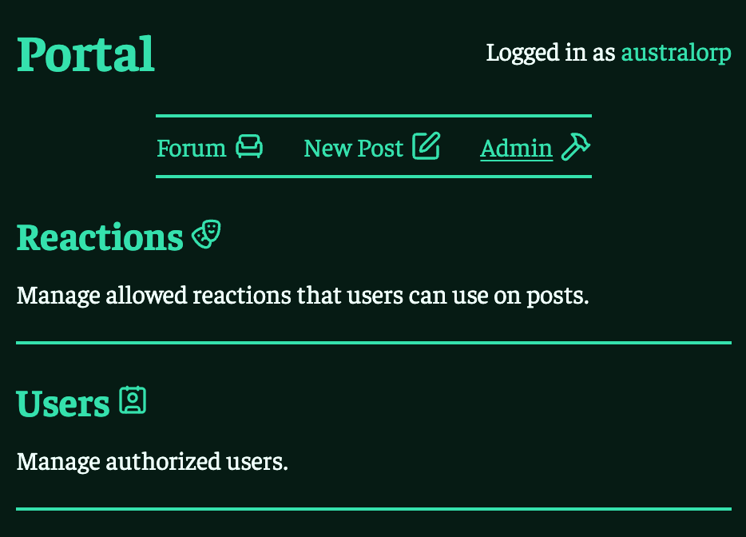
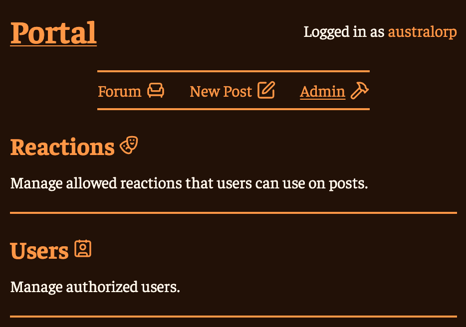

CSS has support for [`OKLCH`](https://developer.mozilla.org/en-US/docs/Web/CSS/Reference/Values/color_value/oklch) colors which are much more intuitive to use than hex codes.
LCH stands for Lightness, Chroma (color intensity), and Hue.
Controlling these values independently makes it easy to fiddle with them manually.
Recently, I have been storing the hue as a CSS variable, and then making my background, text, and primary colors using it.

```css
:root {
  --hue: 300;
  --col-txt: oklch(100% 7% var(--hue));
  --col-pri: oklch(15% 100% var(--hue));
  --col-bg:  oklch(15% 20% var(--hue));
}
```

I first learned this from [Modern CSS patterns in Campfire by Jason Zimdars](https://dev.37signals.com/modern-css-patterns-and-techniques-in-campfire/).

Most sites have a single primary color which could be used for buttons, borders, or links.
*Typically*, it looks better if your whites and blacks are tinted slightly in the same hue as this primary color, instead of using pure white and black.
You could probably find some serious studies or resources on this, but I am too lazy to look.
My websites look better to me when I follow this rule, so that is good enough for me.
Here is an example of a primary color and a non-tinted white and black:

<div class="color-example example1">
    <div></div>
    <div></div>
    <div></div>
</div>

And here is an example where I tint the white and black:

<div class="color-example example2">
    <div></div>
    <div></div>
    <div></div>
</div>

<style>
  .color-example {
    --hue: 300;
    width: 100%;
    max-width: 800px;
    height: 300px;
    display: flex;
    border: 2px solid black;
    > * {
      flex: 1;
      height: 100%;
    }
  }

  .example1 > div:nth-child(1) {
    background-color: #ffffff;
  }
  .example1 > div:nth-child(2) {
    background-color: oklch(15% 100% var(--hue));
  }
  .example1 > div:nth-child(3) {
    background-color: #000000;
  }

  .example2 > div:nth-child(1) {
    background-color: oklch(100% 7% var(--hue));
  }
  .example2 > div:nth-child(2) {
    background-color: oklch(15% 100% var(--hue));
  }
  .example2 > div:nth-child(3) {
    background-color: oklch(15% 20% var(--hue));
  }
</style>

This is a pretty subtle example.
You wouldn't want to go too overboard for your whites and blacks, but you can always make some intermediate shades if you need.

Here is a demo website where I used these techniques.



And by changing one line, I can completely change the color of everything.



To make the dark theme work, I just made my primary color lighter so it could stand out against the background color.
