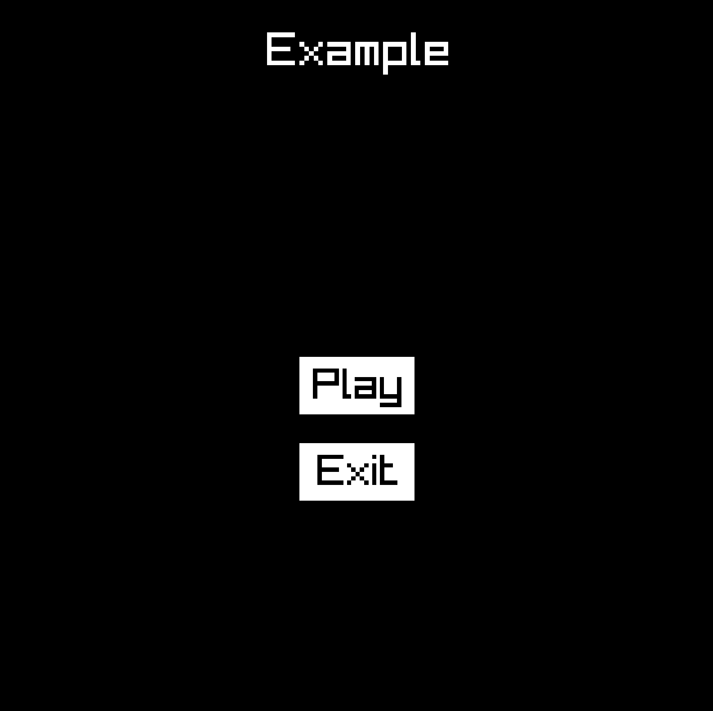
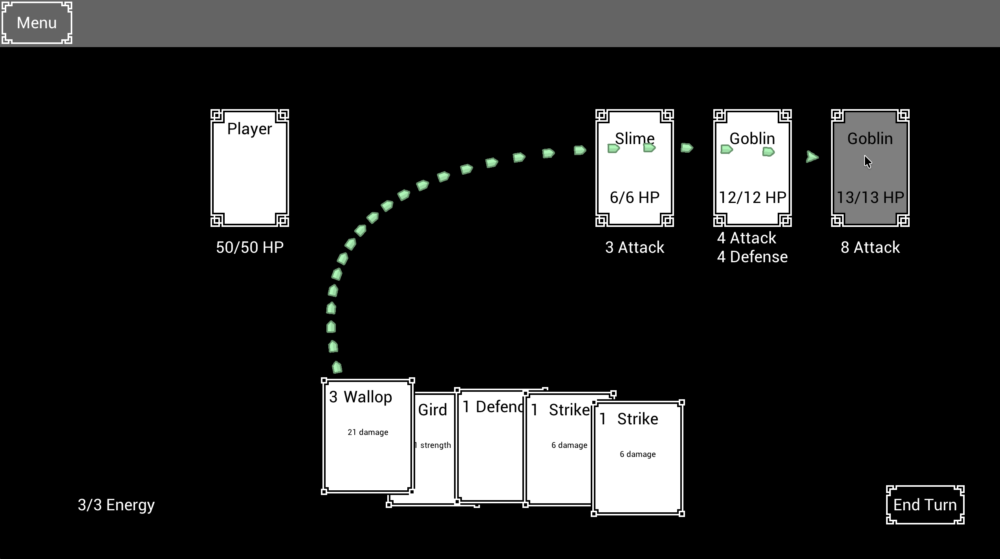

I enjoy making little games, but I struggle to get very far working on them when I use a game engine like Godot or Unity.
Something about the OOP style and the GUI-driven development process keeps me from making any significant progress.

In contrast, I have a lot more fun and am more productive when I skip the engine and use a lower level library like [Raylib](https://www.raylib.com/) or [karl2d](https://karl2d.com/).
The primary downside (and benefit!) of ditching the game engine is you lose all the goodies the engines bring along.
One of the biggest things I miss from Godot is its UI system.

Coming from a web development background, I am used to developing user interfaces from a very high level.
Browsers do a *ton* of work to layout websites and coordinate DOM updates, protecting web developers from a mountain of complexity.
When I first started making games, rolling my own UI system was intimidating, so I always put it off.
And if you keep putting off such a vital aspect of your game, eventually you will abandon the project.

At some point, I started hearing about [immediate mode](https://en.wikipedia.org/wiki/Immediate_mode_(computer_graphics)) UIs.
Rather than using an object system like the DOM that you mutate every frame, it is much simpler to blast away the previous frame's UI layout, and re-layout everything from scratch on the current frame.
It sounds wasteful at first, but it's powerful in practice because it eliminates an entire class of bugs involved in retaining and mutating UI node state across frames.
And as long as your UI is not enormously complicated, it should be cheap to calculate element positions each frame.

I think I first heard about the concept from [Casey Muratori](https://caseymuratori.com/), and at some point later on, I found [Clay](https://github.com/nicbarker/clay) which is a great C library for writing *declarative* immediate mode UIs.
Here is a snippet of how you can use Clay to write a basic layout:

```c
// An example of laying out a UI with a fixed width sidebar and flexible width main content
CLAY(CLAY_ID("OuterContainer"), { .layout = { .sizing = {CLAY_SIZING_GROW(0), CLAY_SIZING_GROW(0)}, .padding = CLAY_PADDING_ALL(16), .childGap = 16 }, .backgroundColor = {250,250,255,255} }) {
    CLAY(CLAY_ID("SideBar"), {
        .layout = { .layoutDirection = CLAY_TOP_TO_BOTTOM, .sizing = { .width = CLAY_SIZING_FIXED(300), .height = CLAY_SIZING_GROW(0) }, .padding = CLAY_PADDING_ALL(16), .childGap = 16 },
        .backgroundColor = COLOR_LIGHT
    }) {
        CLAY(CLAY_ID("ProfilePictureOuter"), { .layout = { .sizing = { .width = CLAY_SIZING_GROW(0) }, .padding = CLAY_PADDING_ALL(16), .childGap = 16, .childAlignment = { .y = CLAY_ALIGN_Y_CENTER } }, .backgroundColor = COLOR_RED }) {
            CLAY(CLAY_ID("ProfilePicture"), { .layout = { .sizing = { .width = CLAY_SIZING_FIXED(60), .height = CLAY_SIZING_FIXED(60) }}, .image = { .imageData = &profilePicture } }) {}
            CLAY_TEXT(CLAY_STRING("Clay - UI Library"), { .fontSize = 24, .textColor = {255, 255, 255, 255} });
        }

        // Standard C code like loops etc work inside components
        for (int i = 0; i < 5; i++) {
            SidebarItemComponent();
        }

        CLAY(CLAY_ID("MainContent"), { .layout = { .sizing = { .width = CLAY_SIZING_GROW(0), .height = CLAY_SIZING_GROW(0) } }, .backgroundColor = COLOR_LIGHT }) {}
    }
}
```

Clay defines various macros which insert structs defining your UI elements into an element buffer.
Then when you go to render your UI, Clay will spit out a command buffer, containing the information needed to render your UI through primitive rendering calls.
Clay will also take in your mouse position and mouse button state each frame, so it can detect clicks and handle scrolling for you.

This is all great and Clay really is enjoyable to use, but I was still struggling to be productive when using it.
I ran into a few small bugs while using the Clay bindings in Odin, and I even tried rolling my own immediate mode system like Clay a few times, but something deeper kept nagging at me.

I kept using or developing a UI *system* capable of describing any generic UI layout, when I really only needed to make *specific* layouts for my games.
**Why develop a generic UI system when I could directly write the specific UI layout that my game needs?**

When I put it like that, it made so much sense and I felt silly for writing a generic UI system.
But it took me quite a while to come to that conclusion.
Watching [Immediate Mode UI and Animations](https://youtu.be/38gVgJj0eFQ) with Casey Muratori and ThePrimeagen gave me that final push over the edge.

Now, when I work on my game ideas, I write my UI in the most brutally simple way I can imagine.
I don't use any declarative macro syntax or shared UI node system.
I don't store render commands into a command buffer.
I define where I want my UI elements to go in my update functions, and then I draw them in my draw functions.
That's it.
I define "screen structs" to represent distinct screens or modals in my game, and I store the state of my UI elements as properties in there.

Here is a specific example using Odin and Raylib:

<details>
    <summary>Example UI code with Odin and Raylib</summary>

```odin
package example

import "core:fmt"
import rl "vendor:raylib"

Vec2 :: rl.Vector2
Rect :: rl.Rectangle
Color :: rl.Color

State :: struct {
    should_exit: bool,
    mouse_claimed: bool,
    screen: HomeScreen,
}

HomeScreen :: struct {
    title_txt: Text,
    play_btn: Button,
    exit_btn: Button,
}

Text :: struct {
    rect: Rect,
    // only using cstring instead of string here because Raylib needs it
    text: cstring,
    font_size: i32,
    color: Color,
}

Button :: struct {
    rect: Rect,
    text: cstring,
    moused: bool,
    mouse_down: bool,
    mouse_held: bool,
    mouse_up: bool,
}

s: ^State

main :: proc() {
    s = new(State)
    defer free(s)

    rl.SetConfigFlags({.WINDOW_RESIZABLE})
    rl.InitWindow(800, 800, "Example")
    rl.SetTargetFPS(60)

    for !s.should_exit && !rl.WindowShouldClose() {
        update()
        draw()
    }

    rl.CloseWindow()
}

update :: proc() {
    s.mouse_claimed = false
    window_size := Vec2 {
        f32(rl.GetScreenWidth()),
        f32(rl.GetScreenHeight()),
    }

    s.screen.title_txt = Text {
        rect = Rect {
            0,
            0,
            window_size.x,
            120,
        },
        text = "Example",
        font_size = 52,
        color = rl.WHITE,
    }

    btn_width := f32(128)
    btn_height := f32(64)
    btn_padding := f32(32)
    x := window_size.x/2-btn_width/2
    y := window_size.y/2

    s.screen.play_btn = Button {
        rect = Rect {
            x,
            y,
            btn_width,
            btn_height,
        },
        text = "Play"
    }
    y += btn_height+btn_padding
    s.screen.exit_btn = Button {
        rect = Rect {
            x,
            y,
            btn_width,
            btn_height,
        },
        text = "Exit"
    }

    poll_btn(&s.screen.play_btn)
    if s.screen.play_btn.mouse_up {
        fmt.println("clicked the play button")
    }
    poll_btn(&s.screen.exit_btn)
    if s.screen.exit_btn.mouse_up {
        fmt.println("clicked the exit button")
        s.should_exit = true
    }
}

poll_btn :: proc(b: ^Button) {
    mouse_pos := rl.GetMousePosition()
    if !s.mouse_claimed && rl.CheckCollisionPointRec(mouse_pos, b.rect) {
        s.mouse_claimed = true
        b.moused = true

        if rl.IsMouseButtonPressed(.LEFT) {
            b.mouse_down = true
        } else if rl.IsMouseButtonDown(.LEFT) {
            b.mouse_held = true
        } else if rl.IsMouseButtonReleased(.LEFT) {
            b.mouse_up = true
        }
    }
}

draw :: proc() {
    rl.BeginDrawing()
    rl.ClearBackground(rl.BLACK)
    draw_txt(s.screen.title_txt)
    draw_btn(s.screen.play_btn)
    draw_btn(s.screen.exit_btn)
    rl.EndDrawing()
}

draw_txt :: proc(t: Text) {
    width := rl.MeasureText(t.text, t.font_size)
    draw_x := t.rect.x+t.rect.width/2-f32(width/2)
    draw_y := t.rect.y+t.rect.height/2-f32(t.font_size/2)
    rl.DrawText(t.text, i32(draw_x), i32(draw_y), t.font_size, t.color)
}

draw_btn :: proc(b: Button) {
    color := rl.BLACK
    bg_color := rl.WHITE
    if b.mouse_held {
        bg_color = rl.SKYBLUE
    } else if b.moused {
        bg_color = rl.LIGHTGRAY
    }
    rl.DrawRectangleRec(b.rect, bg_color)
    draw_txt(Text {
        rect = b.rect,
        text = b.text,
        font_size = 48,
        color = color,
    })
}
```

</details>

Here is what the example UI looks like:

<div style="max-width: 500px;">



</div>

And here is a more complex UI from a card game I am working on:



There is so much more to say about this method of development, but I will close with another reason I enjoy writing my UI this way.
Most UI elements in a game require some custom layout code or have some unique behaviors.
In a card game, you will always need custom code to layout the cards in a fan pattern or draw an arrow that points to the selected card.
If you are going to write custom code for most elements anyway, **why not skip the overpowered UI system and write the code like a caveman?**
