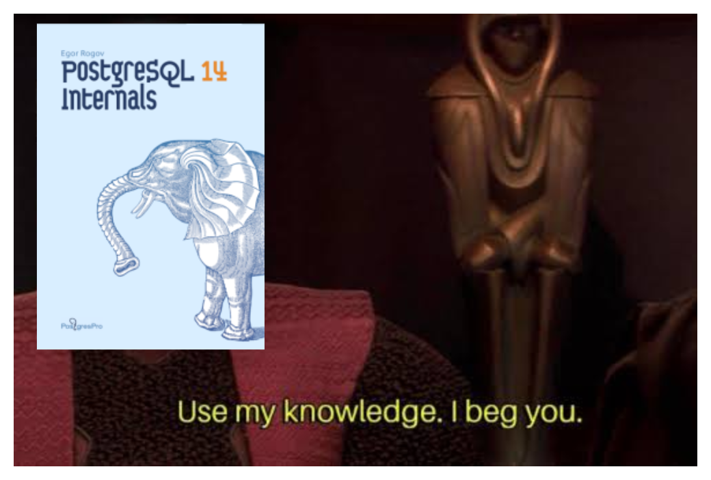

I recently discovered [PostgreSQL 14 Internals](https://postgrespro.com/community/books/internals) ([direct PDF link](https://edu.postgrespro.com/postgresql_internals-14_en.pdf)).
A book which, as made obvious by its title, covers the internal workings of Postgres.
I haven't read it cover-to-cover, but I have read significant portions and enjoyed it.
I have already used it as a reference multiple times.

The information contained is very useful, but perhaps more useful are the techniques the author uses to demonstrate how Postgres works.
The book invites the reader to play along and look through Postgres' internals for themselves.

Just one or two days after starting to read through it, I have already had an opportunity to use it.
I was creating a unique index on a new column.
The base table has ~400,000 rows, but I knew that only ~100 of those rows would have a non-null value in this index.
Before reading this book, I would have likely thought nothing of this.
I would have created the index and moved on with my life.

But because this book was fresh in my mind, I took a few seconds to look at my newly created index using this query:

```sql
select pg_size_pretty(pg_relation_size(c.oid)) as size, c.*
from pg_class c
order by pg_relation_size(c.oid) desc
```

<figure>

#### Note:

If you are using [psql](https://www.postgresql.org/docs/current/app-psql.html), use `\di+` to examine all your indexes.
Run `\?` to see all commands available to you.

</figure>

Running this query made me realize that my index with only ~100 useful entries was taking up 8MB!
The index took up more than 1,000 pages on disk when the data I actually cared about could fit into 2 pages.

Offended at that fact, I quickly recreated the index using a `where col is not null` filter to make it a [partial index](https://www.postgresql.org/docs/current/indexes-partial.html).
That improved things considerably.
8MB turned into 16KB.
I ran a few queries with `EXPLAIN ANALYZE` to ensure the access paths I cared about were still covered by my updated index.

I have spent maybe 45 minutes reading through this book, but I have already benefited from it.
Too many people are comfortable treating their database as a black box.
Databases are designed to work as black boxes to a certain extent, but there are great performance benefits and space savings waiting for people who take the time to look inside the box.
